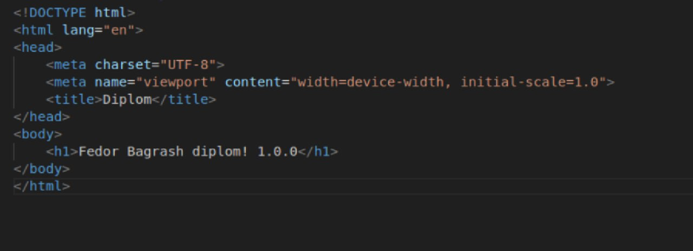

# Дипломный практикум в Yandex.Cloud
  * [Цели:](#цели)
  * [Этапы выполнения:](#этапы-выполнения)
     * [Создание облачной инфраструктуры](#создание-облачной-инфраструктуры)
     * [Создание Kubernetes кластера](#создание-kubernetes-кластера)
     * [Создание тестового приложения](#создание-тестового-приложения)
     * [Подготовка cистемы мониторинга и деплой приложения](#подготовка-cистемы-мониторинга-и-деплой-приложения)
     * [Установка и настройка CI/CD](#установка-и-настройка-cicd)
  * [Что необходимо для сдачи задания?](#что-необходимо-для-сдачи-задания)
  * [Как правильно задавать вопросы дипломному руководителю?](#как-правильно-задавать-вопросы-дипломному-руководителю)

---
## Цели:

1. Подготовить облачную инфраструктуру на базе облачного провайдера Яндекс.Облако.
2. Запустить и сконфигурировать Kubernetes кластер.
3. Установить и настроить систему мониторинга.
4. Настроить и автоматизировать сборку тестового приложения с использованием Docker-контейнеров.
5. Настроить CI для автоматической сборки и тестирования.
6. Настроить CD для автоматического развёртывания приложения.

---
## Этапы выполнения:


### Создание облачной инфраструктуры

1. Создаю два каталога для двух terraform
```
mkdir ~/devops_diplom/terraform-main ~/devops_diplom/S3-bucket and account
```
2. Создаю сервисный аккаунт для своего каталога в Яндекс Облаке и авторизованный ключ для него через веб-интерфейс

3. Содержимое ключа помещаю в файл ~/devops_diplom/main/authorized_keys/authorized_key_file.json
4. Добавляю .gitignore в каталог ~/devops_diplom/main/authorized_keys/ с содержимым
```
*key*
```
5. Выполняю terraform init в каталоге ~/devops_diplom/S3-bucket and account
6. Добавляю стандартный для terraform-проекта .gitignore в каталоги ~/devops_diplom/S3-bucket and account/ и ~/devops_diplom/main
7. Создаю provider.tf
```
terraform {
  required_providers {
    yandex = {
      source = "yandex-cloud/yandex"
    }
  }
  required_version = ">=1.8.4"
  
  
}

provider "yandex" {
  cloud_id                 = var.cloud_id
  folder_id                = var.folder_id
  service_account_key_file = file("~/devops_diplom/main/authorized_keys/authorized_key_file.json")
  zone                     = var.default_zone
}
```
8. Добавляю variables.tf
```
variable "cloud_id" {
  description = "Yandex Cloud ID"
  type        = string
}

variable "folder_id" {
  description = "Yandex Folder ID"
  type        = string
}

variable "default_zone" {
  description = "Default zone"
  type = string
  default = "ru-central1-a"
}
```
9. account.tf, kms.tf, bucket.tf, с помощью этих файлов создаю сервисный аккаунт

account.tf
```
resource "yandex_iam_service_account" "terraform" {
  name        = "terraform"
  description = "Service account for Terraform"
}

resource "yandex_resourcemanager_folder_iam_member" "terraform-storage-role" {
  folder_id = var.folder_id
  role      = "editor"
  member    = "serviceAccount:${yandex_iam_service_account.terraform.id}"
}
```
kms.tf
```
resource "yandex_kms_symmetric_key" "bucket_key" {
  name              = "bucket_key"
  description       = "KMS ключ"
  default_algorithm = "AES_256"
  rotation_period   = "8760h" # 1 год
}
```
bucket.tf
```
resource "yandex_storage_bucket" "tf-bucket-s3" {
  bucket     = "tf-bucket-s3"
  acl        = "private"
  max_size   = 1073741824 # 1GB

  server_side_encryption_configuration {
    rule {
      apply_server_side_encryption_by_default {
        kms_master_key_id = yandex_kms_symmetric_key.bucket_key.id
        sse_algorithm      = "aws:kms"
      }
    }
  }

  depends_on = [yandex_kms_symmetric_key.bucket_key]
}
```

10. Выполняю terraform apply

11. Добавляю полученные ключи в переменные окружения $ACCESS_KEY и $SECRET_KEY
```
#!/bin/bash
export AWS_ACCESS_KEY_ID=$(cat access_key)
export AWS_SECRET_ACCESS_KEY=$(cat secret_key)
```
12. Перехожу к каталогу main. Описываю backend вместе с провайдером в файле provider.tf
```
terraform {
    required_providers {
        yandex = {
            source = "yandex-cloud/yandex"
        }
    }
    backend "s3" {
        endpoints = {
            s3 = "https://storage.yandexcloud.net"
        }
        bucket = "tf-bucket-s3"
        region = "ru-central1"
        key = "terraform.tfstate"
        skip_region_validation = true
        skip_credentials_validation = true
        skip_requesting_account_id = true
        skip_s3_checksum = true
    }
}

provider "yandex" {
    zone = var.default_zone
    service_account_key_file = var.authorized_key_file
    cloud_id = var.cloud_id
    folder_id = var.folder_id
}
```
13. Выполняю команду terraform init

14. Помещаю в ~/devops_diplom/main/authorized_keys авторизованный ключ сервисного аккаунта, публичный ssh-ключ.

15. Описываю переменные для создаваемых инстансов в файле vm-variables.tf
```
variable "platform_id" {
    type = string
    description = "standard-v1/standard-v2/standard-v3"
}
variable "vm-cores" {
    type = number
    description = "Core count"
}
variable "vm-ram" {
    type = number
    description = "RAM Volume"
}
variable "vm-core_fraction" {
    type = number
    description = "core fraction (in percent)"
}
variable "vm-preemptible" {
    type = bool
    description = "Preemptible (true/false)"
}
variable "vm-disk-image_id" {
    type = string
    description = "image id"
}
variable "vm-disk-size" {
    type = number
    description = "Disks volume"
}
variable "vm-disk-type" {
    type = string
}
```
16. Описываю переменные для доступа к Яндекс Облаку в файле variables.tf
```
variable "cloud_id" {
    type = string
    description = "Yandex.Cloud Identifier"
}
variable "folder_id" {
    type = string
    description = "Folder Identifier"
}
variable "default_zone" {
    type = string
    description = "Default Zone"
}
variable "authorized_key_file" {
    type = string
    description = "Path to Storage.editor Service Account's authorized_key file"
}
```
17. Заполняю terraform.tfvars

18. Добавляю файл kubernetes-instances.tf с описанием инстансов и подсетей, которые хочу создать
```
locals {
  subnets = {
    "subnet-ru-central1-a" = { zone = "ru-central1-a", cidr = "192.168.100.0/24" },
    "subnet-ru-central1-b" = { zone = "ru-central1-b", cidr = "192.168.110.0/24" },
    "subnet-ru-central1-d" = { zone = "ru-central1-d", cidr = "192.168.120.0/24" }
  }
  vms = {
    "vm-ru-central1-a" = { zone = "ru-central1-a", subnet_name = "subnet-ru-central1-a" },
    "vm-ru-central1-b" = { zone = "ru-central1-b", subnet_name = "subnet-ru-central1-b" },
    "vm-ru-central1-d" = { zone = "ru-central1-d", subnet_name = "subnet-ru-central1-d" }
  }
}

resource "yandex_vpc_network" "kuber-network" {
    name = "kuber-network"
}

resource "yandex_vpc_subnet" "subnet" {
  for_each       = local.subnets
  name           = each.key
  zone           = each.value.zone
  network_id     = yandex_vpc_network.kuber-network.id
  v4_cidr_blocks = [each.value.cidr]
}

resource "yandex_compute_instance" "kuber-vm" {
  for_each    = local.vms
  name        = each.key
  platform_id = var.platform_id
  zone        = each.value.zone
  allow_stopping_for_update = true
  resources {
    cores  = var.vm-cores
    memory = var.vm-ram
    core_fraction = var.vm-core_fraction
  }
  scheduling_policy {
    preemptible = var.vm-preemptible
  }
  boot_disk {
    initialize_params {
      image_id = var.vm-disk-image_id
      type = var.vm-disk-type
      size = var.vm-disk-size
    }
  }
  network_interface {
    index = 0
    subnet_id = yandex_vpc_subnet.subnet[each.value.subnet_name].id
    nat       = true
  }
  metadata = {
    ssh-keys = "ubuntu:${file("./authorized_keys/id_ed25519.pub")}"
  }
}

resource "yandex_lb_target_group" "ingress_target_group" {
  name = "ingress-target-group"
  dynamic "target" {
    for_each = yandex_compute_instance.kuber-vm
    content {
      subnet_id = target.value.network_interface.0.subnet_id
      address   = target.value.network_interface.0.ip_address
    }
  }
}

resource "yandex_lb_network_load_balancer" "ingress_lb" {
  name = "ingress-load-balancer"
  listener {
    name = "http-listener"
    port = 80
    external_address_spec {
      ip_version = "ipv4"
    }
  }

  attached_target_group {
    target_group_id = yandex_lb_target_group.ingress_target_group.id
    healthcheck {
      name = "tcp"
      tcp_options {
        port = 80
      }
    }
  }
}

output "Kubernetes-instances-private-IPs" {
  value = { for k, v in yandex_compute_instance.kuber-vm : k => v.network_interface.0.ip_address }
  description = "Private IP addresses of the created instances"
}
output "Kubernetes-instances-public-IPs" {
  value = { for k, v in yandex_compute_instance.kuber-vm : k => v.network_interface.0.nat_ip_address }
  description = "Public IP addresses of the created instances"
}
output "load_balancer_external_ip" {
  value       = yandex_lb_network_load_balancer.ingress_lb.listener[*].external_address_spec[*].address
  description = "External IP address of the Network Load Balancer"
}
```
20. Выполняю terraform apply в каталоге ~/devops_diplom/main


---
### Создание K8s кластера

1. Для работы с kubespray понадобится: 
- склонировать репозиторий https://github.com/kubernetes-sigs/kubespray на свою ВМ
- установить ansible и pip3

```
sudo apt install ansible pyhon3-pip -y
cd ~/devops_diplom && git clone https://github.com/kubernetes-sigs/kubespray
cd kubespray && pip install -r requirements.txt
```

2. Копирую пример конфига кластера в отдельную директорию
```
cp -rfp inventory/sample inventory/netology-cluster
```
3. В каталог terraform-main добавляю файл ansible_inventory.tf в котором описана автоматическая генерация inventory-файла для kubespray
```
locals {

  vm_roles = {
    "vm-ru-central1-a" = "master"
    "vm-ru-central1-b" = "worker1"
    "vm-ru-central1-d" = "worker2"
  }

  hosts = {
    for vm_name, instance in yandex_compute_instance.kuber-vm : local.vm_roles[vm_name] => {
      ansible_host = instance.network_interface.0.nat_ip_address
      access_ip    = instance.network_interface.0.nat_ip_address
      ip           = instance.network_interface.0.ip_address
      ansible_user = "ubuntu"
    }
  }
}

resource "local_file" "ansible_inventory" {
  content = templatefile("${path.module}/inventory.tmpl", {
    hosts = local.hosts
  })
  filename = "${path.module}/../kubespray/inventory/netology-cluster/inventory.yml"
}
```
4. В файле ~/devops_diplom/kubespray/inventory/netology-cluster/group_vars/k8s_cluster/k8s-cluster.yml ищу параметр kubeconfig_localhost и выставляю его в true для того, чтобы на локальной машине появился конфиг подключения к кластеру. Также снимаю комментарий с этой строки

5. В файле ~/devops_diplom/kubespray/inventory/netology-cluster/group_vars/k8s_cluster/addons.yml выставляю параметры:

```
ingress_nginx_enabled: true
ingress_nginx_service_type: NodePort
```
Это понадобится для маршрутизации http-запросов между двумя приложениями - grafana и nginx-test-app

6. Запускаю terraform apply снова, для того, чтобы сгенерировать inventory-файл
```
cd ~/devops_diplom/terraform-main && terraform apply
```
```
all:
  hosts:
    master:
      ansible_host: 89.169.131.130
      access_ip: 89.169.131.130
      ip: 192.168.100.21
      ansible_user: ubuntu
    worker1:
      ansible_host: 130.193.41.139
      access_ip: 130.193.41.139
      ip: 192.168.110.4
      ansible_user: ubuntu
    worker2:
      ansible_host: 130.193.45.22
      access_ip: 130.193.45.22
      ip: 192.168.120.26
      ansible_user: ubuntu
  children:
    kube_control_plane:
      hosts:
        master:
    kube_node:
      hosts:
        master:
        worker1:
        worker2:
    etcd:
      hosts:
        master:
    k8s_cluster:
      children:
        kube_control_plane:
        kube_node:
```

7. Запускаю ansible-playbook
```
cd ../kubespray/ && ansible-playbook -i inventory/netology-cluster/inventory.yml cluster.yml -b
```

8. Устанавливаю kubectl на локальную ВМ
```
sudo snap install kubectl --classic
```
9. Копирую содержимое файла ~/devops_diplom/kubespray/inventory/netology-cluster/artifacts/admin.conf в файл ~/.kube/config
```
mkdir ~/.kube && cp ~/devops_diplom/kubespray/inventory/netology-cluster/artifacts/admin.conf ~/.kube/config
```
10. Проверяю подключение к кластеру
```
kubectl get pods --all-namespaces
```


---
### Создание тестового приложения

1. Создал папку nginx-test-app
2. app.dockerfile:
```
FROM nginx:alpine
COPY ./nginx-test-app/index.html /usr/share/nginx/html
EXPOSE 80
```
3. В настройках репозитория добавил DOCKER_USERNAME и DOCKER_HUB_ACCESS_TOKEN для доступа из github к dockerhub
4. Собрал и запушил в dockerhub через пайплайн
```
env:
  IMAGE_NAME: tud777777/devops_diplom
  KUBE_NAMESPACE: netology
  KUBE_DEPLOYMENT: nginx-test-app-deployment.yaml
  KUBE_SERVICE: nginx-test-app-service.yaml

jobs:
  build-and-push:
    name: Build and Push Docker Image
    runs-on: ubuntu-latest
    environment: k8s
    steps:
      - name: Checkout code
        uses: actions/checkout@v3

      - name: Check secrets
        run: |
          echo ${{ secrets.DOCKER_HUB_USERNAME }}
          echo ${{ secrets.DOCKER_HUB_ACCESS_TOKEN }}

      - name: Log in to Docker Hub
        uses: docker/login-action@v2
        with:
          username: ${{ secrets.DOCKER_HUB_USERNAME }}
          password: ${{ secrets.DOCKER_HUB_ACCESS_TOKEN }}

      - name: Build Docker image
        run: docker build -t $IMAGE_NAME:latest -f nginx-test-app/app.dockerfile .

      - name: Push Docker image
        run: docker push $IMAGE_NAME:latest
```

5. Ссылка на docker hub https://hub.docker.com/repository/docker/tud777777/devops_diplom/general

6. Добавил также в пайплайн стейдж deploy
```
  deploy-to-k8s:
    name: Deploy to Kubernetes
    runs-on: ubuntu-latest
    environment: k8s
    needs: build-and-push
    steps:
      - name: Checkout code
        uses: actions/checkout@v3

      - name: Set up kubectl
        uses: azure/setup-kubectl@v3
        with:
          version: 'latest'

      - name: Configure kubeconfig (raw)
        run: |
          mkdir -p "$HOME/.kube"
          printf '%s' "${{ secrets.KUBECONFIG }}" > "$HOME/.kube/config"
          chmod 600 "$HOME/.kube/config"

      - name: Apply Deployment
        run: |
          kubectl apply -f nginx-test-app/$KUBE_DEPLOYMENT -n $KUBE_NAMESPACE
          kubectl apply -f nginx-test-app/$KUBE_SERVICE -n $KUBE_NAMESPACE
          kubectl rollout restart deployment/nginx-test-app -n netology
```

---
### Подготовка cистемы мониторинга и деплой приложения

Для деплоя prometheus мной был выбран вариант через helm chart

1. Создаю namespace netology в котором будут находиться nginx-test-app и monitoring
```
kubectl create namespace netology
```
2. Устанавливаю helm
```
sudo snap install helm --classic
```
3. Добавляю репозиторий prometheus в helm
```
helm repo add prometheus-community https://prometheus-community.github.io/helm-charts
helm repo update
```
4. Устанавливаю prometheus через helm командой:
```
helm install monitoring prometheus-community/kube-prometheus-stack --namespace netology
```

5. Применяю конфиг для ingress
```
kubectl apply -f ~/devops_diplom/nginx-test-app/ingress.yaml
```

```
apiVersion: networking.k8s.io/v1
kind: Ingress
metadata:
  name: netology-ingress
  namespace: netology
  annotations:
    nginx.ingress.kubernetes.io/rewrite-target: /
spec:
  rules:
  - http:
      paths:
      - path: /
        pathType: Prefix
        backend:
          service:
            name: monitoring-grafana
            port:
              number: 80      
      - path: /nginx-test-app
        pathType: Prefix
        backend:
          service:
            name: nginx-test-app-service
            port:
              number: 80
```

6. Запускаю пайплайн для деплоя сервиса и деплоймента приложения

7. Проверяю доступность nginx-test-app


8. Получаю пароль от УЗ admin в grafana
```
kubectl --namespace netology get secrets monitoring-grafana -o jsonpath="{.data.admin-password}" | base64 -d ; echo
```
9. Захожу на веб-интерфейс grafana для добавления дашбордов с метриками kubernetes. Я выбрал этот дашборд - https://grafana.com/grafana/dashboards/18283-kubernetes-dashboard/

Добавляю через Dashboards -> New -> Import 


### Пример обновления приложения через пайплайн

1. Изменяю код приложения

2. Пушу изменения и запускается пайплайн

3. Проверяю что поды запустились

4. Приложение успешно обновилось

